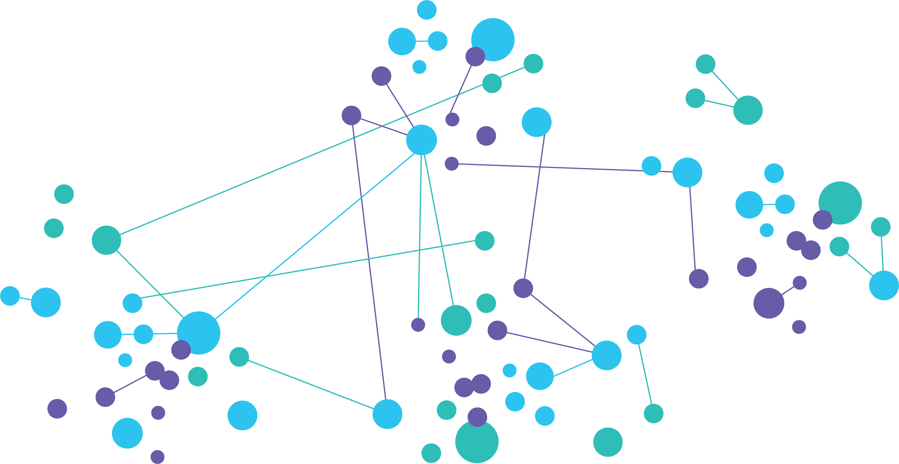

# Machine learning access through API
<!--
*** Thanks for checking out the Best-README-Template. If you have a suggestion
*** that would make this better, please fork the repo and create a pull request
*** or simply open an issue with the tag "enhancement".
*** Thanks again! Now go create something AMAZING! :D
***
***
***
*** To avoid retyping too much info. Do a search and replace for the following:
*** github_username, repo_name, twitter_handle, email, project_title, project_description
-->

<!-- PROJECT SHIELDS -->
<!--
*** I'm using markdown "reference style" links for readability.
*** Reference links are enclosed in brackets [ ] instead of parentheses ( ).
*** See the bottom of this document for the declaration of the reference variables
*** for contributors-url, forks-url, etc. This is an optional, concise syntax you may use.
*** https://www.markdownguide.org/basic-syntax/#reference-style-links
-->
[![Contributors][contributors-shield]][contributors-url]
[![Forks][forks-shield]][forks-url]
[![Stargazers][stars-shield]][stars-url]
[![Issues][issues-shield]][issues-url]
[![LinkedIn][linkedin-shield]][linkedin-url]

<!-- PROJECT LOGO -->
 

  

  <h3 align="center">Machine learning access through API</h3>

  

    Number recognition and spam/ham detection implementations
     
    <a href="https://github.com/kristopy/AI-API"><strong>Explore the docs »</strong></a>
     
     
    <a href="https://github.com/kristopy/AI-API/issues">Report Bug</a>
    ·
    <a href="https://github.com/kristopy/AI-API/issues">Request Feature</a>
  

<!-- ABOUT THE PROJECT -->
## About The Project

<!-- MARKDOWN LINKS & IMAGES -->
<!-- https://www.markdownguide.org/basic-syntax/#reference-style-links -->
[contributors-shield]: https://img.shields.io/github/contributors/kristopy/repo.svg?style=for-the-badge
[contributors-url]: https://github.com/kristopy/AI-API/contributors
[forks-shield]: https://img.shields.io/github/forks/kristopy/repo.svg?style=for-the-badge
[forks-url]: https://github.com/kristopy/AI-API//network/members
[stars-shield]: https://img.shields.io/github/stars/kristopy/repo.svg?style=for-the-badge
[stars-url]: https://github.com/kristopy/AI-API//stargazers
[issues-shield]: https://img.shields.io/github/issues/kristopy/repo.svg?style=for-the-badge
[issues-url]: https://github.com/kristopy/AI-API//issues
<!-- [license-shield]: https://img.shields.io/github/license/kristopy/repo.svg?style=for-the-badge
[license-url]: https://github.com/kristopy/RaspberryPi_Real-Time-monitoring/blob/master/LICENSE.txt -->
[linkedin-shield]: https://img.shields.io/badge/-LinkedIn-black.svg?style=for-the-badge&logo=linkedin&colorB=555
[linkedin-url]: https://linkedin.com/in/kristofferwv
